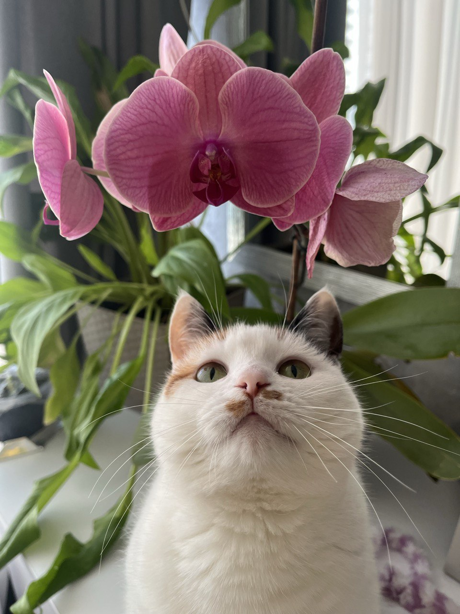
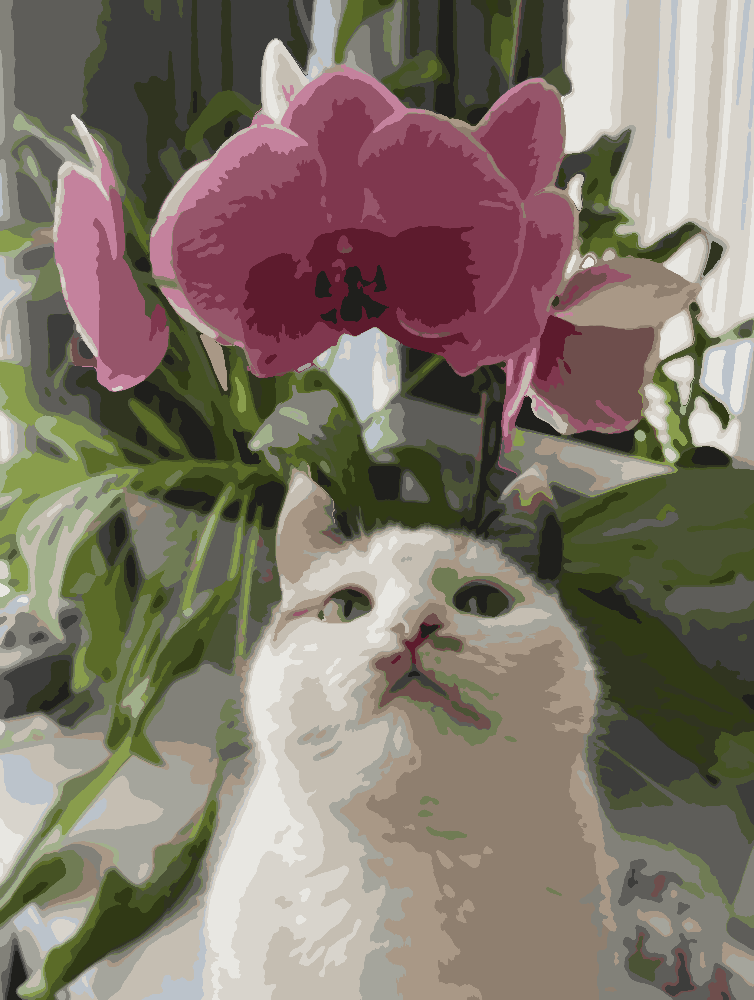
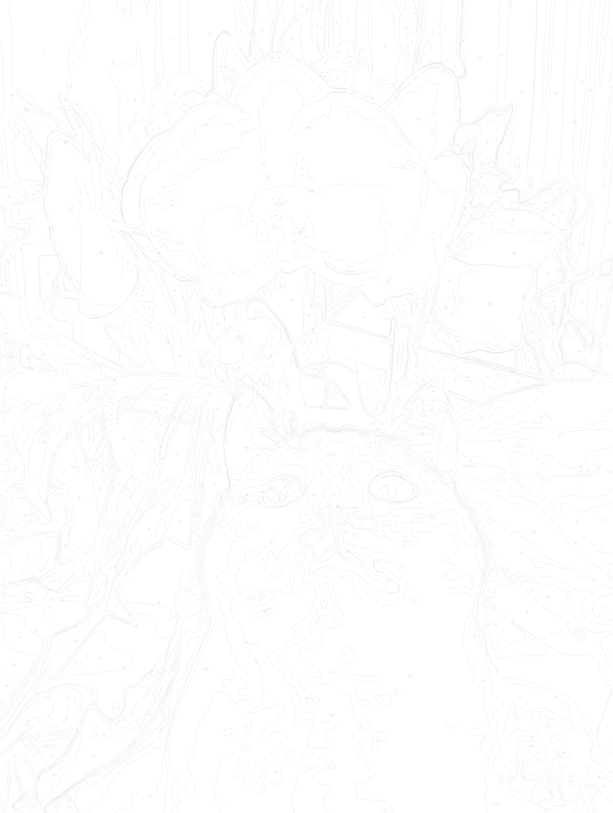

# Paint by Numbers Image Generator

A Python tool that converts images into paint-by-numbers templates with optimized color palettes and numbered regions.

## Examples

### Input Image



### Step 1: Color-Optimized Image

The script first converts the image to use a limited color palette while maintaining visual quality:



### Step 2: Paint-by-Numbers Template

Then it generates a black & white template with numbered regions and borders:



## Requirements

- Python 3.10 or higher
- Pillow (PIL)
- NumPy

(check requirements.txt)

## Installation

1. Clone the repository:

```bash
git clone https://github.com/Volodymyr-Hamalii/generate_image_to_paint_by_numbers.git
cd generate_image_to_paint_by_numbers
```

2. Create a virtual environment (recommended):

```bash
python3 -m venv .venv
source .venv/bin/activate  # On Windows: .venv\Scripts\activate
```

3. Install dependencies:

```bash
pip install -r requirements.txt
```

## Usage

1. Place your images in the `images/` folder (supports common formats: PNG, JPG, etc.)

2. Configure the processing parameters in `parameters.json` (see Parameters section below)

3. Run the script:

```bash
python main.py
```

4. Find the output images in the `outputs/` folder. For each input image, two files are generated:
   - `*_in_colors.png` - Image with optimized color palette
   - `*_by_numbers.png` - Black & white paint-by-numbers template

## Parameters Configuration

Edit `parameters.json` to customize the image processing:

### Basic Settings

- **`images_to_process`** (list of strings)
  - Specific image filenames to process (e.g., `["markiza.jpg"]`)
  - Leave empty `[]` to process all images in the `images/` folder

### Image Size

- **`image_size_in_mm`** (object)
  - `width`: Target width in millimeters (can be `null`)
  - `height`: Target height in millimeters (can be `null`)
  - At least one dimension must be specified
  - If only one dimension is provided, the other is calculated automatically to maintain the original aspect ratio
  - Example: `{"width": 2000, "height": null}` will calculate height based on image proportions

### Color Settings

- **`to_use_only_allowed_colors`** (object)

  - `value` (boolean): If `true`, uses only colors from `allowed_colors` list. If `false`, uses k-means clustering to find optimal colors
  - `allowed_colors` (list): Hex color codes to use when `value` is `true` (e.g., `["#FF0000", "#00FF00", "#0000FF"]`)

- **`max_number_of_colors`** (integer)
  - Maximum number of colors to use when `to_use_only_allowed_colors.value` is `false`
  - Typically between 10-30 for good paint-by-numbers complexity

### Region Settings

- **`min_region_size_in_mm`** (integer)

  - Minimum size for paintable regions in millimeters
  - Smaller regions are automatically merged with neighbors
  - Larger values create simpler templates with bigger areas to paint

- **`compactness_passes`** (list of objects)

  - Controls merging of thin/elongated regions to create more paintable shapes
  - Each pass has:
    - `threshold` (float): Compactness threshold (0.0-1.0, where 1.0 is a perfect circle)
    - `max_area` (integer): Maximum region area to check for compactness
    - `name` (string): Descriptive name for the pass
  - Multiple passes can be configured for progressive merging
  - Example:

    ```json
    [
      { "threshold": 0.25, "max_area": 2000, "name": "Pass 1" },
      { "threshold": 0.4, "max_area": 1500, "name": "Pass 2" }
    ]
    ```

### Border Settings

- **`border`** (object)
  - `width_in_mm` (float): Border width between regions in millimeters
  - `color` (string): Border color as hex code (e.g., `"#E6E6E6"` for light gray)

### Number Settings

- **`numbers`** (object)
  - `color` (string): Color for region numbers as hex code
  - `font_size_in_mm` (object):
    - `min` (integer): Minimum font size in millimeters for small regions
    - `max` (integer): Maximum font size in millimeters for large regions

## Example Configuration

```json
{
  "images_to_process": ["markiza.jpg"],
  "image_size_in_mm": {
    "width": 2000,
    "height": null
  },
  "min_region_size_in_mm": 500,
  "compactness_passes": [
    {
      "threshold": 0.25,
      "max_area": 2000,
      "name": "Pass 1"
    }
  ],
  "border": {
    "width_in_mm": 0.25,
    "color": "#E6E6E6"
  },
  "numbers": {
    "color": "#D9D9D9",
    "font_size_in_mm": {
      "min": 8,
      "max": 14
    }
  },
  "to_use_only_allowed_colors": {
    "value": false,
    "allowed_colors": []
  },
  "max_number_of_colors": 24
}
```

## How It Works

1. **Image Loading**: Reads images from the `images/` folder
2. **Color Reduction**: Uses either k-means clustering (optimal colors) or maps to a predefined palette (allowed colors)
3. **Region Segmentation**: Identifies continuous regions of the same color
4. **Region Merging**: Combines small regions and elongated regions based on configured thresholds
5. **Template Generation**: Creates a black & white template with numbered regions and borders

## Tips

- Start with `max_number_of_colors` around 20-25 for a good balance
- Increase `min_region_size_in_mm` if you want larger, simpler regions
- Use `to_use_only_allowed_colors` if you have a specific paint set and want exact color matching
- The processing time depends on image size and complexity (typically 1-5 minutes per image)
